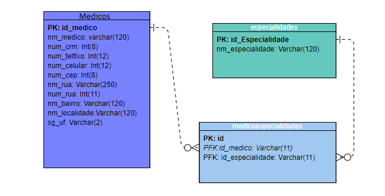

<h1>API REST DE CADASTRO DE MÉDICOS</h1>

Desenvolvido por Jeferson Oliveira

  <h2>Tecnologias</h2>
  
<ol>
  <li>NodeJS</li>
  <li>Framework NestJS</li>
  <li>TypeScript</li>
  <li>Sequelize</li>
  <li>Banco de dados MARIADB/MYSQL</li>
  <li>Validação ValidationPipe</li>
  <li>Sequelize-cli Migrations and seeds</li>
  <li>Fetch para fazer a requisições XHR assíncronoas</li>
</ol>

Insert
 

Update
 

Select
 

Soft Delete
 

Ao cadastrar o CEP é feita uma requisição  via XHR para a API dos correios e retorna todos os dados de endereço do médico

Ao cadastrar o médico ele deve ter mais de duas especialidades
 
  <h1>Modelagem do banco de dados</h1>
  

